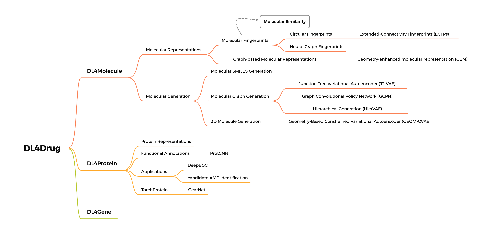

# DL4Drug

💊 The Road to Deep Learning for Drugs. A list of papers mentioned in this repo could be found from the [references](references).

### Mind Map

# Contents

## Molecular Representations
### Molecular Fingerprints

- [Circular Fingerprints](molecular_representations/molecular_fingerprints/circular_fingerprints)
- [Extended-connectivity fingerprints (ECFPs)](molecular_representations/molecular_fingerprints/extended-connectivity_fingerprints)
- [Neural Graph Fingerprints](molecular_representations/molecular_fingerprints/neural_graph_fingerprints)

### Graph-based Molecular Representations

- [3DMol-Net](molecular_representations/graph-based_molecular_representations/3DMol-Net)

- [GDL on Molecular Representations](molecular_representations/geometry-based_molecular_representations/GDL_on_molecular_representations) 

## Molecular Generation

- [Junction Tree Variational Autoencoder (JT-VAE)](molecular_generation/junction_tree_variational_autoencoder)

## DL4Protein

- [DeepBGC](dl4protein/DeepBGC)

- [ProtCNN](dl4protein/ProtCNN)

- [TorchProtein](dl4protein/TorchProtein)

## Deep Learning Technology

- [Geometric Deep Learning](deep_learning_technology/GDL)

