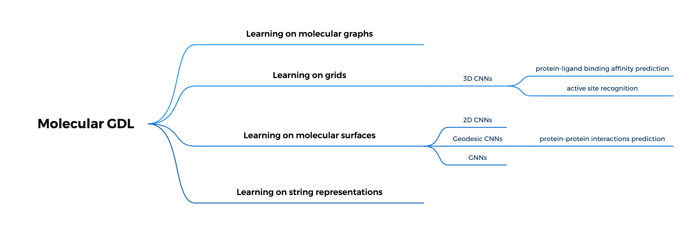

# Geometric deep learning on molecular representations

## Introduction

几何深度学习（GDL）基于包含和处理对称信息的神经网络架构。

GDL 为依赖于具有不同对称性和抽象级别的分子表示的分子建模应用程序带来了希望。

深度学习的两个特点使其在应用于分子时很有希望：

- 可以处理**非结构化**数据表示，例如文本序列、语音信号、图像和图形
- 可以从输入数据中进行特征提取（或特征学习）

几种分子表示：

a. Kekulé structure

b. Molecular graph

c. SMILES

d. Three-dimensional (3D) graph

e. Molecular surface

## GDL

### Principles of geometric deep learning

几何深度学习（GDL）是近几年人工智能领域提出的一个新兴概念。GDL 是一个总称，涵盖了将神经网络推广到欧几里德和非欧几里德域的新兴技术，例如图、流形、网格或字符串表示。

一般来说，GDL 包括结合几何先验的方法，即输入信号的结构空间和对称特性的信息，例如分子结构的表示，利用几何先验来提高模型的质量。

## Molecular GDL

### Learning on molecular graphs

Deep learning methods devoted to handling graphs as input are commonly referred to as graph neural networks (GNNs). The most popular of them fall under the umbrella term of **message passing neural networks**.

### Learning on grids

### Learning on molecular surfaces

### Learning on string representations

## Applications

- 药物发现
- 化学合成预测
- 量子化学

## Vocabulary

- geometric priors

Information about the structure and symmetry of the system of interest.

- symmetry group

## References

- [Geometric Deep Learning on Molecular Representations](https://arxiv.org/pdf/2107.12375.pdf)
- [可对药物分子进行表征的几何深度学习](https://www.jiqizhixin.com/articles/2021-12-27-2)
- [Geometric Deep Learning](https://geometricdeeplearning.com)